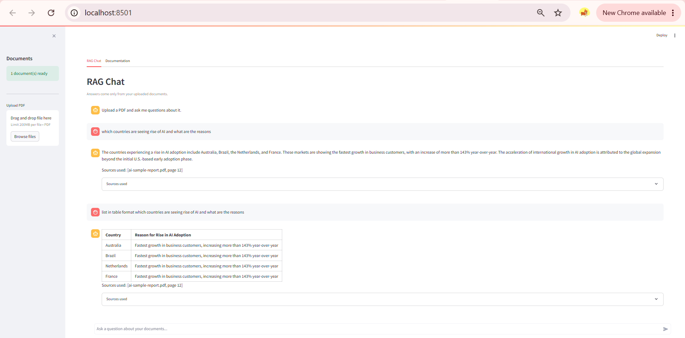
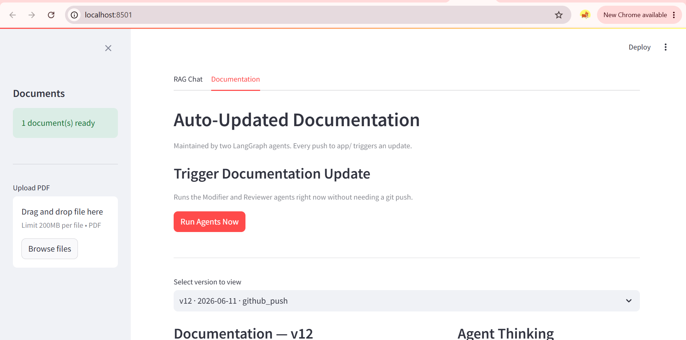
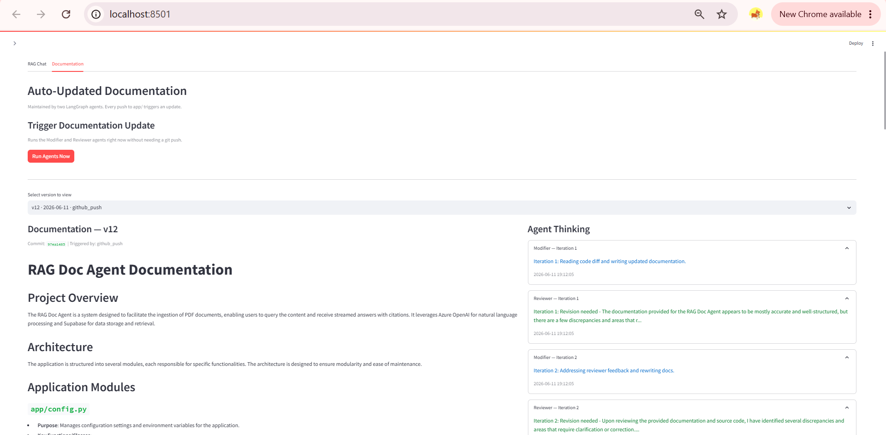
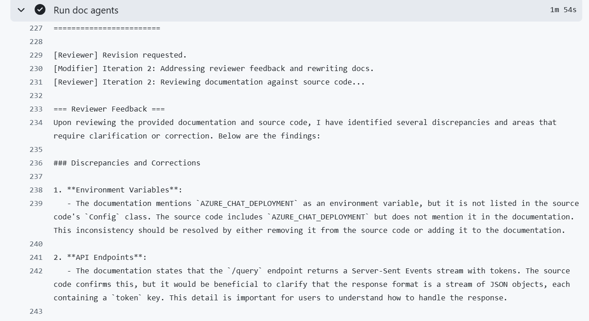
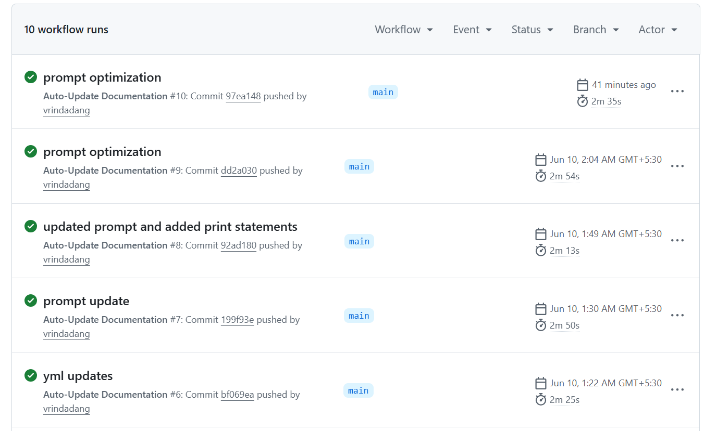

# RAG Doc Agent — Multimodal RAG + LangGraph Documentation Agent

A project that combines **Multimodal Retrieval-Augmented Generation (RAG)** with an **Agentic Documentation Workflow** powered by LangGraph.

Users can upload PDF documents, ask questions grounded in document content, and automatically generate technical documentation whenever the codebase changes.

---

## Features

### Multimodal RAG Chat

* Upload PDF documents and query their contents
* Extracts:

  * Native text
  * Structured tables
  * Visual/chart descriptions using Azure OpenAI Vision
* Retrieval powered by Supabase pgvector
* Streaming responses with source citations
* ChatGPT-style Streamlit interface
* Tracks uploaded documents for querying

### Agentic Documentation Workflow

When code changes are pushed:

1. GitHub Actions detects changes in `app/` or `agents/`
2. A Modifier Agent generates updated documentation
3. A Reviewer Agent validates documentation against the source code
4. LangGraph orchestrates iterative review cycles
5. Documentation versions and agent logs are stored in Supabase
6. The latest documentation is automatically committed to `docs/latest.md`

Built using LangGraph's `StateGraph`.

---

## Architecture

### RAG Pipeline

```text
PDF Upload
    ↓
PyMuPDF Extraction
(Text + Tables + Visual Content)
    ↓
Azure OpenAI Embeddings
    ↓
Supabase pgvector
    ↓
Retriever
    ↓
GPT-4o Response Generation
    ↓
Streamlit UI
```

### Documentation Agent Workflow

```text
GitHub Push
    ↓
GitHub Actions
    ↓
Modifier Agent
    ↓
Reviewer Agent
    ↓
Approved?
 ├── No → Iterate
 └── Yes
    ↓
Store Version
    ↓
Update docs/latest.md
```

---

## Screenshots

### RAG Chat



Ask questions about uploaded PDFs and receive grounded responses with citations.

### Documents Sidebar



View uploaded documents and add new PDFs for ingestion.

### Documentation Viewer



Browse generated documentation versions and inspect generated content.

### Agent Logs



View Modifier and Reviewer iterations generated by the LangGraph workflow.

### GitHub Actions Automation



Automatic documentation generation triggered by repository changes.

---

## Tech Stack

| Layer               | Technology                        |
| ------------------- | --------------------------------- |
| Backend API         | FastAPI                           |
| UI                  | Streamlit                         |
| LLM                 | Azure OpenAI GPT-4o / GPT-4o-mini |
| Embeddings          | text-embedding-3-small            |
| Vector Store        | Supabase pgvector                 |
| PDF Processing      | PyMuPDF                           |
| Agent Framework     | LangGraph                         |
| Workflow Automation | GitHub Actions                    |
| Storage             | Supabase                          |

---

## Project Structure

```text
rag-doc-agent/
├── app/
│   ├── main.py
│   ├── ingestor.py
│   ├── retriever.py
│   ├── generator.py
│   ├── prompt_builder.py
│   └── config.py
│
├── agents/
│   ├── doc_updater.py
│   └── supabase_store.py
│
├── ui/
│   └── streamlit_app.py
│
├── docs/
│   └── latest.md
│
├── screenshots/
│
├── .github/
│   └── workflows/
│       └── update-docs.yml
│
├── sample_docs/
│
├── requirements.txt
└── .gitignore
```

---

## Running Locally

### Clone Repository

```bash
git clone https://github.com/vrindadang/rag-doc-agent.git
cd rag-doc-agent
```

### Create Virtual Environment

```bash
python -m venv venv
```

Windows:

```bash
venv\Scripts\activate
```

macOS/Linux:

```bash
source venv/bin/activate
```

### Install Dependencies

```bash
pip install -r requirements.txt
```

### Configure Environment Variables

Create a `.env` file:

```env
AZURE_OPENAI_API_KEY=...
AZURE_OPENAI_ENDPOINT=...
AZURE_OPENAI_API_VERSION=...
CHAT_DEPLOYMENT=...
AZURE_CHAT_DEPLOYMENT=...
EMBEDDING_DEPLOYMENT=...

SUPABASE_URL=...
SUPABASE_ANON_KEY=...
SUPABASE_SERVICE_KEY=...
SUPABASE_BUCKET=...
```

### Run Streamlit

```bash
streamlit run ui/streamlit_app.py
```

### Run FastAPI

```bash
uvicorn app.main:app --reload
```

API documentation:

```text
http://localhost:8000/docs
```

---

## GitHub Actions Automation

The workflow monitors:

```text
app/**
agents/**
```

When changes are detected:

* Generates updated documentation
* Runs Modifier and Reviewer agents
* Stores documentation versions in Supabase
* Saves agent logs
* Updates `docs/latest.md`
* Commits documentation changes back to the repository

> GitHub Actions workflow automation is currently disabled in this public repository because it depends on private Azure OpenAI and Supabase credentials. To enable automation in your own fork, configure the required repository secrets and enable the workflow.

---

## Documentation Versioning

Generated documentation versions are stored in Supabase.

The Streamlit Documentation tab allows users to:

* Browse historical versions
* View generated documentation
* Inspect Modifier/Reviewer logs
* Track documentation evolution over time

---

## Security

* `.env` files are excluded via `.gitignore`
* API keys are never committed to the repository
* GitHub Actions uses repository secrets
* Supabase service credentials remain server-side

---

## Future Improvements

* Human-in-the-loop approval workflow
* Documentation diff visualization
* Agent memory across versions
* Multi-document collections
* Automated evaluation metrics
* Additional retrieval strategies
* Documentation quality scoring
